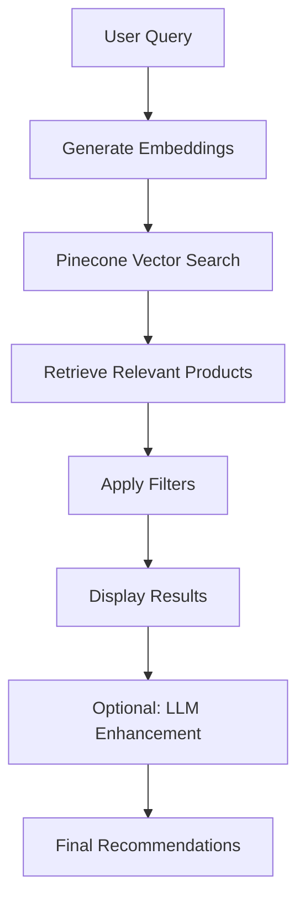

# Retail Recommendation Agent with RAG

This project implements a Retrieval-Augmented Generation (RAG) recommendation agent for retail products. It combines vector similarity search with large language model capabilities to provide personalized product recommendations.

## 📁 Project Structure

```
├── 00_generate_synthetic_retail_data.ipynb    # Generates synthetic retail data
├── 01_recommendation_agent_rag.ipynb          # Main RAG implementation
├── app.py                                     # Streamlit web interface
├── .env                                       # API keys (not included in repo)
├── pdf/
│   ├── 00_generate_synthetic_retail_data.ipynb
│   └── synthetic_retail_data/                 # Generated retail data
│       ├── products.csv                       # Product catalog (30 items)
│       ├── customers.json                     # Customer profiles (10)
│       ├── inventory.json                     # Stock information
│       ├── promotions.json                    # Promotional rules
│       ├── images/                            # Product images
│       └── README_generated_files.md          # Data usage instructions
└── retail_rag_env/                            # Python virtual environment
```

## 🚀 Features

- **Synthetic Data Generation**: Creates realistic retail data including products, customers, inventory, and promotions
- **Vector Embeddings**: Uses sentence-transformers to create product embeddings
- **Vector Database**: Pinecone for efficient similarity search
- **Retrieval System**: Finds relevant products based on user queries
- **LLM Integration**: (Optional) Uses Llama-2 via Hugging Face for natural language recommendations
- **Web Interface**: Streamlit app for interactive product recommendations
- **Filtering**: Price and category filters for refined searches

## 🛠️ Setup

1. **Clone the repository**:
   ```bash
   git clone <repository-url>
   cd retail-recommendation-agent
   ```

2. **Create a virtual environment**:
   ```bash
   python -m venv retail_rag_env
   source retail_rag_env/bin/activate  # On Windows: retail_rag_env\Scripts\activate
   ```

3. **Install dependencies**:
   ```bash
   pip install -r requirements.txt
   ```

4. **Set up API keys**:
   Create a `.env` file with your API keys:
   ```
   PINECONE_API_KEY=your_pinecone_api_key
   HUGGINGFACE_API_KEY=your_huggingface_api_key  # Optional for LLM features
   ```

5. **Generate synthetic data** (if needed):
   Run `00_generate_synthetic_retail_data.ipynb` to generate new retail data.

## ▶️ Usage

### Jupyter Notebook
1. Open and run `01_recommendation_agent_rag.ipynb`
2. Follow the cells to see the complete RAG pipeline in action

### Streamlit Web App
1. Run the Streamlit app:
   ```bash
   streamlit run app.py
   ```
2. Access the web interface at `http://localhost:8501`
3. Enter product queries and use filters to get recommendations

## 📊 Workflow



## 🧠 Technical Details

### Data Generation
- **Products**: 30 items with SKUs, descriptions, pricing, categories, brands
- **Customers**: 10 profiles with purchase histories
- **Inventory**: Stock levels across multiple stores and warehouse
- **Promotions**: Special offers and discount rules

### RAG Pipeline
1. **Data Loading**: Reads product data from CSV files
2. **Embedding Creation**: Uses `sentence-transformers/all-MiniLM-L6-v2` to create 384-dimension vectors
3. **Vector Storage**: Stores embeddings in Pinecone with metadata
4. **Retrieval**: Finds similar products using cosine similarity
5. **Recommendation**: (Optional) Enhances results with Llama-2 natural language generation

### Technologies Used
- **Python**: Core programming language
- **Jupyter Notebooks**: Development and experimentation
- **Streamlit**: Web interface
- **Pinecone**: Vector database
- **Sentence Transformers**: Text embeddings
- **Hugging Face**: (Optional) LLM integration
- **Pandas**: Data processing

## 📈 Example Queries

- "Need black sneakers for college under 6000"
- "Looking for a lightweight jacket for travel"
- "Affordable smartphone with good camera"

## 📝 License

This project is licensed under the MIT License - see the [LICENSE](LICENSE) file for details.

## 🤝 Contributing

Contributions are welcome! Please feel free to submit a Pull Request.#
