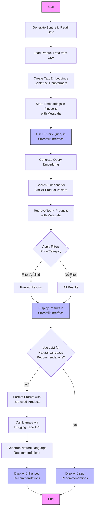
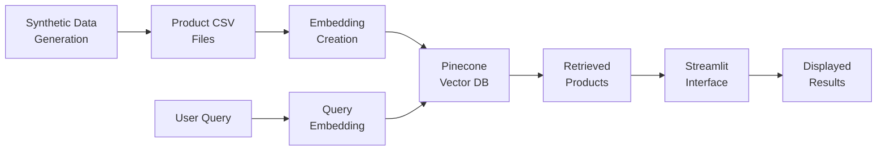

# RAG Recommendation System Flowchart

This diagram illustrates the complete workflow of the retail recommendation agent using Retrieval-Augmented Generation.

## Component Descriptions

1. **Data Generation**: Creates synthetic retail data including products, customers, inventory, and promotions
2. **Data Loading**: Reads product information from CSV files
3. **Embedding Creation**: Transforms product descriptions into vector representations
4. **Vector Storage**: Stores embeddings in Pinecone for efficient similarity search
5. **User Interface**: Streamlit web app for entering queries and displaying results
6. **Query Processing**: Converts user queries into embeddings for search
7. **Vector Search**: Finds similar products using cosine similarity
8. **Filtering**: Applies price and category filters to refine results
9. **LLM Enhancement**: (Optional) Uses Llama-2 to generate natural language recommendations
10. **Result Display**: Shows recommendations in the web interface

## Data Flow

